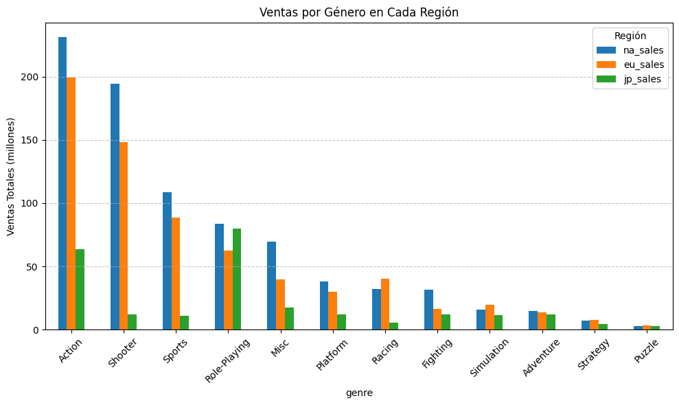
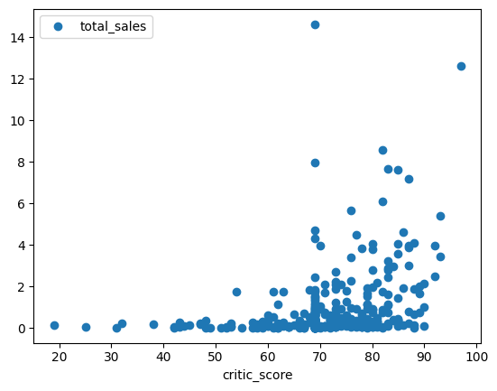
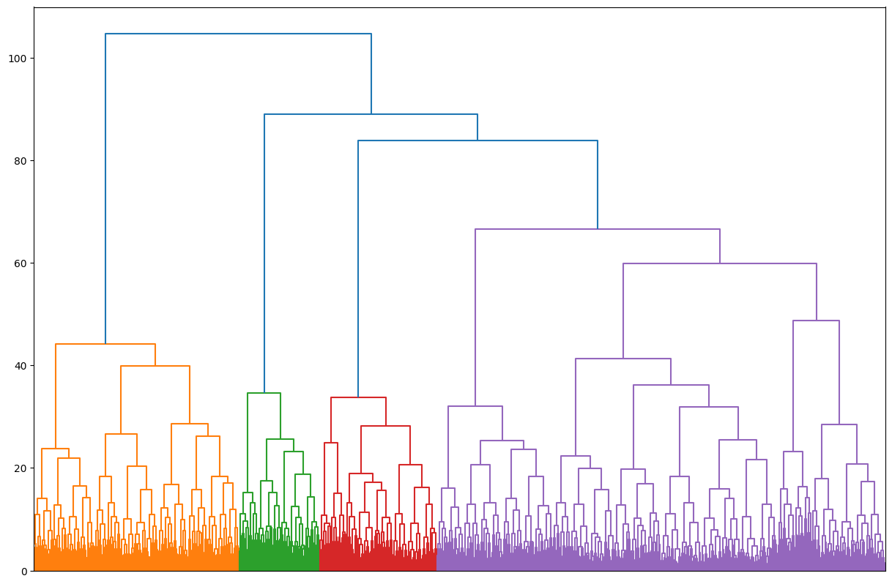

# Portafolio
## acerca de mi
Analista de Datos Junior | Python | SQL | Visualización de Datos | En constante aprendizaje

Apasionado por transformar datos en insights accionables. Aunque mi experiencia profesional en tecnología es reciente, mi determinación, capacidad de aprendizaje rápido y mentalidad analítica me impulsan a crecer cada día. Mi objetivo es superarme constantemente y aportar valor a través del análisis de datos.

## Habilidades Técnicas
Python (Pandas, Matplotlib, Seaborn, Scikit-learn, SciPy) – Análisis de datos, estadística y machine learning básico.

SQL – Consultas, manipulación y gestión de bases de datos.

Visualización de Datos – Creación de dashboards y reportes claros.

HTML5 – Conocimientos básicos para integración con análisis web.

JavaScript & C++ – Lectura y comprensión de código (experiencia previa en desarrollo de software).

## Formación Relevante
Bootcamp de Análisis de Datos en TripleTen (LatAm) – Enfoque práctico en Python, SQL y herramientas clave del análisis de datos.

Técnico en Desarrollo de Software – Bases en programación (JavaScript, C++, MySQL).

## Soft Skills Clave
Trabajo en equipo y bajo presión – Gracias a mi experiencia como salvavidas.

Comunicación efectiva – Habilidad para explicar conceptos técnicos de manera clara (derivada de ser instructor de surf).

Pensamiento analítico – Detección de patrones y toma de decisiones rápidas.

Motivación
"Quiero ser mejor mañana de lo que soy hoy" – Busco oportunidades donde pueda aplicar mis habilidades técnicas mientras aprendo de profesionales experimentados. Abierto a colaboraciones, proyectos desafiantes y mentorías.

* * *

# Proyectos seleccionados

## Compoertamiento de usuarios y Embudo de ventas

Este estudio examina el embudo de ventas de una app de una compañía de alimentos para detectar en qué fases hay una mayor caída de usuarios. Además, utiliza un experimento A/A/B para evaluar si un cambio en el diseño tipográfico puede incrementar la tasa de conversión frente al diseño original. La finalidad es ofrecer conclusiones respaldadas por datos que orienten las decisiones estratégicas relacionadas con el diseño y la usabilidad de la aplicación.

#### Herramientas y tipo de proyecto

### Preguntas principales
1. ¿En qué pasos del embudo de ventas se pierden más usuarios?
2. ¿Qué proporción de usuarios finaliza todo el proceso, desde el inicio hasta la compra?
3. ¿Influye de manera relevante la modificación tipográfica en las tasas de conversión?
4. ¿Existen diferencias significativas entre los grupos de control y el grupo experimental?

### Enfoque metodológico

**Limpieza y preparación de datos**: Se normalizaron los nombres de las columnas, se eliminaron registros repetidos y se descartaron datos inconsistentes o faltantes.
**Evaluación del embudo de ventas**: Se definieron los eventos principales y se midió el porcentaje de usuarios que transitan de una etapa a otra.
**Pruebas A/A/B**: Se analizaron las tasas de conversión entre los grupos de control y el experimental utilizando métodos estadísticos para validar diferencias significativas.

## Hallazgos y sugerencias

**Análisis del embudo de ventas:**
La mayor pérdida de usuarios ocurre en la etapa "OffersScreenAppear", con un 61.9% de abandonos.

Únicamente el 48% de los clientes completa todo el proceso hasta una compra exitosa.

**Resultados del test A/A/B:**
No se detectaron variaciones estadísticamente relevantes entre los grupos de control y el experimental.

El rediseño tipográfico no mejora las conversiones, por lo que no se aconseja su implementación.

**Acciones sugeridas:**
Mejorar la pantalla de ofertas para reducir el alto índice de abandonos en esta fase.

Explorar otras modificaciones en la interfaz o funcionalidades que puedan tener un efecto más significativo en el rendimiento.

### Visualizaciones
 1. **Enbudo de ventas:** La etapa con mayor tasa de abandono es OfferScreenAppear, donde el 38% de los usuarios no completa esta fase.

 2. **Intervalo de análisis:** El conjunto de datos completo tiene registros desde el 1 de agosto de 2019, por lo que se excluyó información previa a esta fecha. El periodo evaluado finalmente comprende la primera semana de agosto de 2019 (del 1 al 7 de agosto).
 

**Explora más detalles del proyecto en el [repositorio completo](https://github.com/Robalcor/test_a-a-b).**

## Analisis de venta de videojuegos
Análisis de ventas de videojuegos por región, plataforma y género para identificar patrones clave, permitiendo a Ice detectar proyectos con alto potencial y diseñar campañas publicitarias efectivas. El estudio de las dinámicas de mercado en Norteamérica, Europa y Japón busca optimizar estrategias de marketing y maximizar el ROI en los lanzamientos más prometedores.

### herramientas y tipo de proyecto

### Puntos clave de investigación
Tendencias de plataformas: Distribución de ventas globales y variaciones regionales.
Preferencias de género: Popularidad comparativa en Norteamérica, Europa y Japón.
Impacto de reseñas: Relación entre puntuaciones (usuarios/críticos) y desempeño comercial.
Diferencias cualitativas: Calificaciones promedio por plataforma y género.

### Enfoque metodológico
Limpieza de datos: Eliminación de inconsistencia (datos faltantes/duplicados) y estandarización de formatos.
EDA: Identificación de patrones en plataformas/géneros y análisis de correlación reseñas-ventas.
Análisis regional: Contraste de preferencias entre mercados clave.
Validación estadística: Pruebas de hipótesis para comparar evaluaciones de usuarios.

### Hallazgos y acciones estratégicas
Preferencias regionales:
1. Occidente: Dominio de acción/disparos en Xbox/PlayStation.
2. Japón: Predominio de RPG en portátiles (3DS).
Influencia de reseñas:
1. Críticos: impactan ventas (r≈0.35)
2. usuarios: mínimo efecto.
La brecha comercial entre géneros sugiere que los juegos con narrativas inmersivas (RPG) o mecánicas competitivas (deportes/disparos) tienen mayor aceptación global.

## Resultados clave:
Xbox One y PC: calificaciones similares.
Acción vs. Deportes: diferencias significativas.

### Recomendaciones:
Priorizar PS4/Xbox One en campañas globales.
Localizar estrategias: RPG en Japón; acción/disparos en Occidente.

## Visualizaciones

**Análisis de ventas por género**
Tendencias destacadas:
- Géneros más vendidos: Acción, disparos (shooters), juegos de rol (RPG) y deportes lideran el mercado.
- Géneros con menor demanda: Rompecabezas y estrategia registran ventas significativamente más bajas.

**Relación entre críticas y desempeño comercial**
Se observa una correlación moderada (coeficiente ~0.4) entre las valoraciones de expertos y el volumen de ventas, lo que sugiere que:
Las reseñas profesionales influyen parcialmente en las decisiones de compra.
Los consumidores no basan su elección únicamente en este factor (otros elementos como franquicias, marketing o preferencias personales podrían tener mayor peso).

repositorio
**Explora más detalles del proyecto en el [repositorio completo](https://github.com/Robalcor/Games).**

## Análisis de retención de clientes para Model Fitness
La retención de clientes es clave en cualquier industria para garantizar ingresos recurrentes y reducir costos de captación (hasta 5 veces más altos). En Model Fitness, el análisis de factores de retención y cancelación permite anticipar abandonos, crear programas de fidelización basados en datos y ofrecer experiencias personalizadas que aumenten el engagement.

#### Herramientas y tipo de proyecto

### Preguntas Clave
¿Qué variables (demográficas o de uso) impactan más en la cancelación?
¿Cómo difieren los clientes leales frente a los que abandonan?
¿Qué segmentos permiten estrategias de retención personalizadas?

### Metodología
Limpieza de datos: Eliminación de duplicados, valores nulos y estandarización.
EDA: Identificación de patrones en cancelaciones (ej: frecuencia de visita, tipo de contrato).
Modelado predictivo: Logistic Regression (72% precisión) y Random Forest (81%) para predecir cancelaciones.
Clustering: Segmentación con K-means para agrupar clientes por comportamiento.

## Hallazgos Clave
Retención alta: Clientes cercanos al gimnasio, con contratos largos (+6 meses) y participación en clases grupales.
Riesgo de cancelación: Jóvenes con contratos mensuales y baja asistencia.

###Acciones Recomendadas
Incentivar contratos largos: Descuentos por compromisos de 3+ meses.

Impulsar clases grupales: Campañas destacando beneficios sociales y motivacionales.

Intervención temprana: Usar el modelo para alertar sobre clientes en riesgo y ofrecer promociones ad-hoc.

Segmentación inicial: Clasificar nuevos clientes por perfil (edad/contrato) para estrategias preventivas.

## visualizaciones

**histogramas de compararion de de caracteristicas no binarias**
Al examinar los patrones entre clientes que permanecen y aquellos que cancelan, emergen dos tendencias claras:

Patrón de contratación
Los clientes que cancelan muestran una marcada preferencia por compromisos a corto plazo, con una abrumadora mayoría optando por membresías mensuales. En contraste, los clientes leales tienden a seleccionar planes de mayor duración.

Perfil demográfico
Se observa una concentración notable de cancelaciones entre usuarios menores de 30 años, mientras que la base de clientes más estables presenta un rango de edad significativamente mayor.

**clusteres**
El dendrograma revela que los clientes se organizan naturalmente en 4 segmentos diferenciados, agrupados según sus características y patrones de comportamiento clave, lo que permite diseñar estrategias de retención personalizadas para cada perfil.

repositorio
**Explora más detalles del proyecto en el [repositorio completo](https://github.com/Robalcor/Model_Fitness).**
